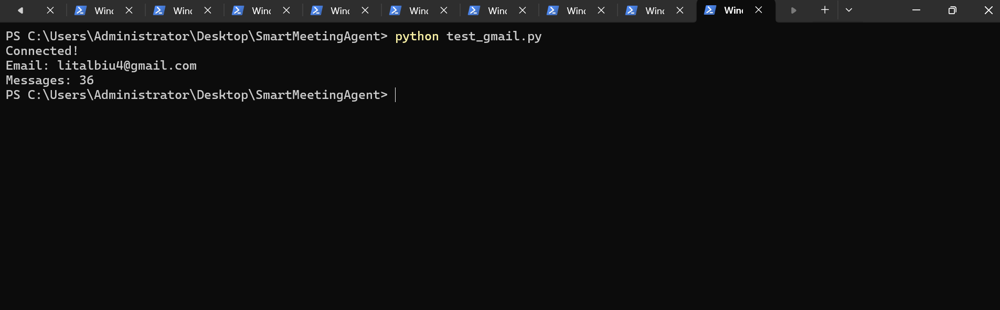
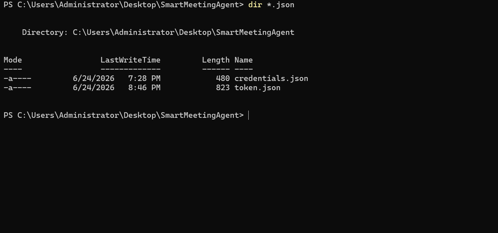
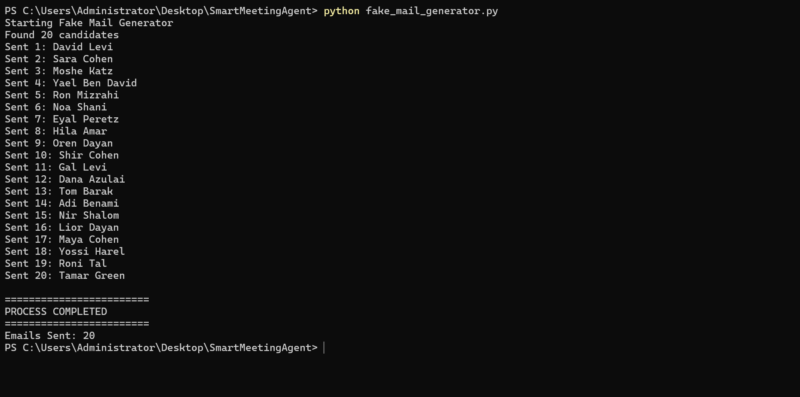
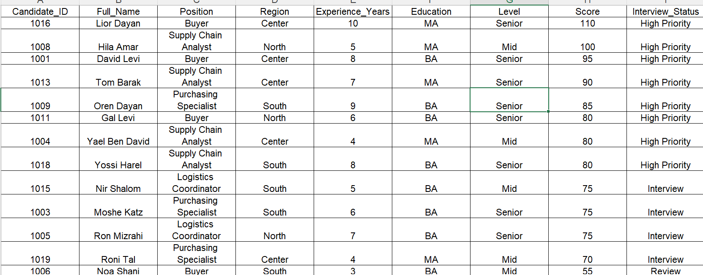

# Smart Meeting Agent

Automated recruitment workflow using Python, Gmail API, OAuth authentication and Excel reporting.

## Project Overview

Smart Meeting Agent is a recruitment automation project that demonstrates how to:

- Connect securely to Gmail using OAuth 2.0
- Generate candidate application emails automatically
- Send emails through Gmail API
- Read and process inbox messages
- Extract candidate information
- Score and rank candidates
- Generate recruitment reports in Excel

The project simulates a complete recruitment workflow from candidate creation to final evaluation.

---

## Project Workflow

1. Create candidate database in Excel
2. Generate candidate application emails automatically
3. Send applications to Gmail using Gmail API
4. Read Gmail inbox automatically
5. Extract candidate information
6. Calculate candidate scores
7. Rank candidates by priority
8. Generate Excel reports

---

## Technologies

- Python
- Gmail API
- OAuth 2.0
- Pandas
- OpenPyXL
- Google Cloud Platform

---

## Main Files

### Core Scripts

- `main.py`
- `fake_mail_generator.py`
- `recruitment_agent.py`
- `create_token.py`
- `test_gmail.py`

### Input Files

- `candidates.xlsx`

### Output Files

- `candidate_results.xlsx`
- `gmail_candidates.xlsx`
- `gmail_summary.txt`
- `generated_emails.txt`

---

## Project Structure

```text
smart-meeting-agent
│
├── README.md
├── requirements.txt
├── .gitignore
│
├── main.py
├── fake_mail_generator.py
├── recruitment_agent.py
├── create_token.py
├── test_gmail.py
│
├── candidates.xlsx
├── candidate_results.xlsx
├── gmail_candidates.xlsx
├── gmail_summary.txt
│
├── docs
│   ├── PRD.md
│   ├── PLAN.md
│   └── TODO.md
│
├── skill
│   └── recruitment_agent.skill.md
│
└── screenshots
    ├── gmail_connection.png
    ├── oauth_setup.png
    ├── email_generation.png
    ├── recruitment_processing.png
    └── candidate_results_report.png
```

---

## Authentication

The project uses Google OAuth 2.0 authentication.

Required APIs:

- Gmail API
- Google Calendar API

Authentication files:

- credentials.json
- token.json

Note: Authentication files are excluded from GitHub for security reasons.

---

## Results

The system successfully:

- Connected to Gmail
- Sent 20 candidate application emails
- Processed inbox messages
- Extracted candidate information
- Calculated candidate scores
- Ranked candidates automatically
- Generated Excel reports

---

## Screenshots

### Gmail Connection



### OAuth Setup



### Email Generation


### Recruitment Processing



### Candidate Results Report



---

## Future Improvements

- AI-based candidate evaluation
- Automatic interview scheduling
- Google Calendar integration
- Email response automation
- Dashboard and analytics
- Recruitment workflow monitoring

---

## Author

Lital Adani

Bar-Ilan University

Supply Chain Management Program
